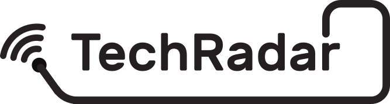

The interactive <strong>Technology Radar</strong> (also called <strong>TechRadar</strong>) describes future technology developments or trends that will impact how makers will create, communicate, organize and might even do business.

Its purpose is to provide state-of-the-art overviews of both: 1) Information and Communication Technology (ICT) and related applications developed and/or used by The results of this research will help to understand the uses and impacts of <strong>CAPS</strong> in different contexts, as well as of the Maker movement itself., and 2) maker technology developed and/or used by makers. This will include the relationships and mutual complementary of the two. In this way, it developes forward scenarios and a watching brief of these two technology areas and how they are used by The results of this research will help to understand the uses and impacts of <strong>CAPS</strong> in different contexts, as well as of the Maker movement itself. and maker communities both respectively and in combination.

Read more [here](http://make-it.io/deliverables/d5-1-report-on-mapping-of-ict-and-maker-technology-and-its-use/) and [here](http://make-it.io/deliverables/d5-2-report-on-forward-scenarios-of-technology-developments-and-technology-use/).

## Installation

Install packages in server and app:

```
cd tr-host
npm install
cd..

cd tr-app
npm install
webpack
```

Run app:

```
cd tr-host
node src/
```

## Docker

If you want to build and run the TechRadar using docker, you can use the following commands for building and running

build:
```
docker build -t makeit/techradar .
```

run:
```
docker run -d -p 8080:80 makeit/techradar
```

The TechRadar will be then accessible at [http://localhost:8080](http://localhost:8080).


## Credits

[](https://ec.europa.eu/digital-agenda/en/news/22-new-caps-projects-horizon-2020)
